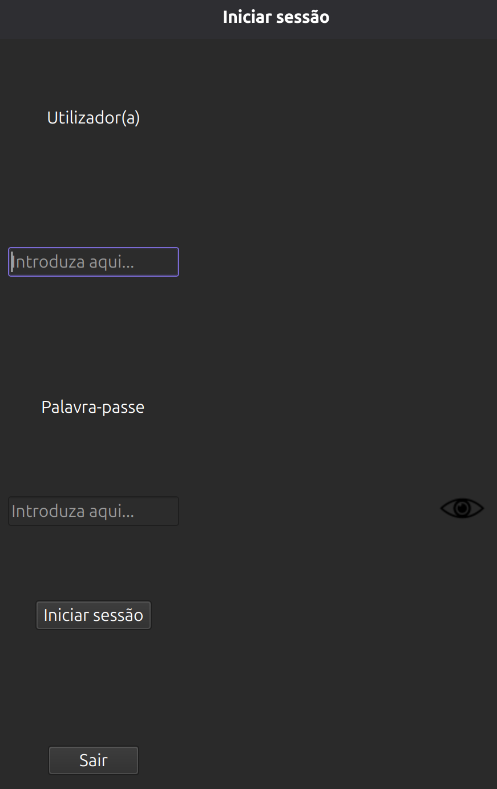
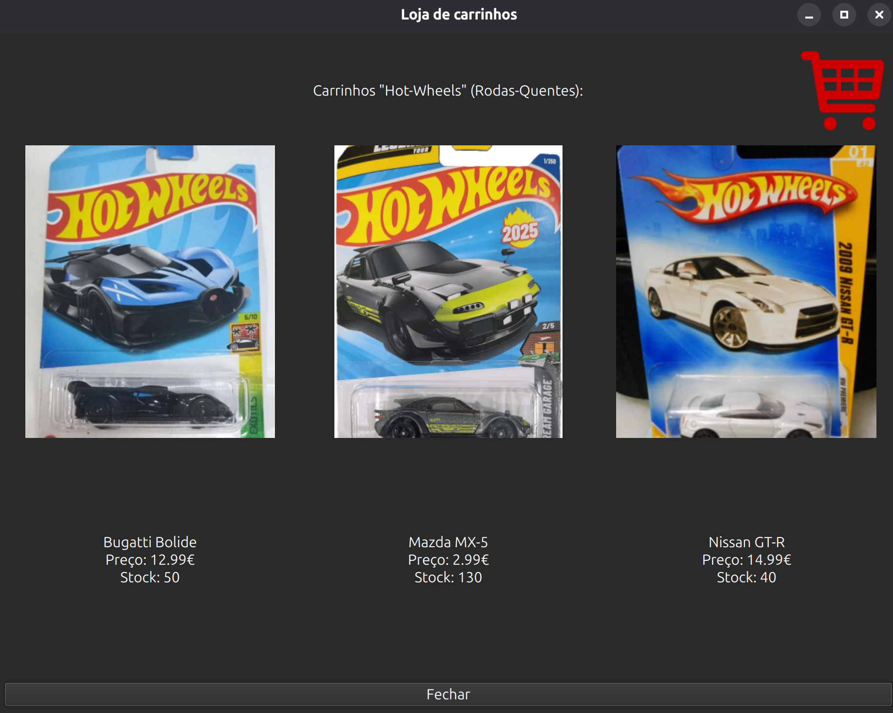
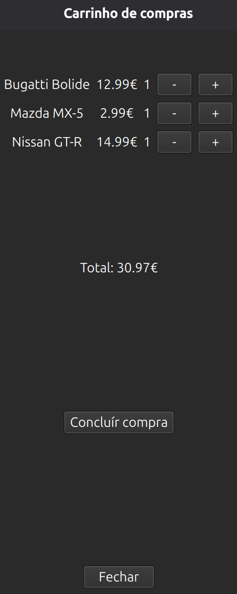
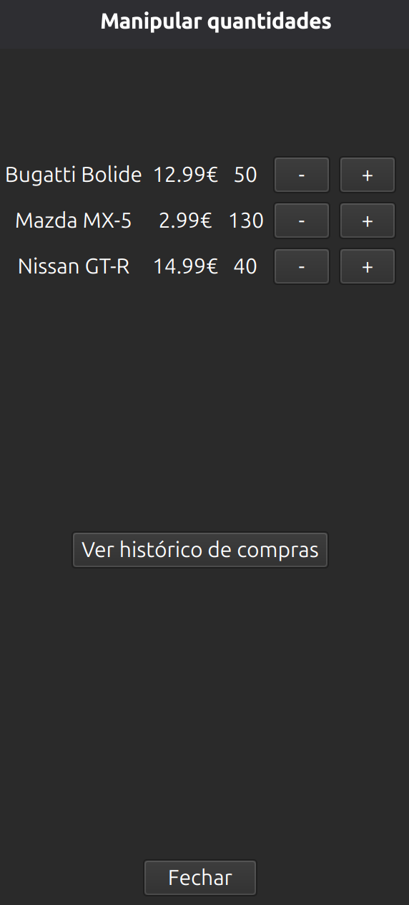

# Loja de carrinhos 🏎️

* Aplicação desenvolvida em Python 3.13 + PySide6, compilada com Nuitka, utilizando SQLite para persistência e PBKDF2 para hashing seguro de passwords.
* Permite comprar, vender e manipular a quantidade de carrinhos. <br />
* Possui uma base de dados reponsável por armazenar as credenciais hasheadas do utilizador e do administrador. <br />
* Também armazena as informações dos carrinhos. <br />
* Cria um relatório de vendas em CSV que pode ser visualizado fácilmente. <br />
* Contém efeitos sonoros e imagens dando ao utilizador uma experiência aconchegante.

## Como executar ⚙️

1. Instalar, criar o venv e instalar dependências 🔧:
```
sudo apt install python3-venv python3-pip
python3 -m venv venv
source ~/venv/bin/activate
pip install -r ~/Transferências/TPI_LP_M13-main/requirements.txt
```

2. Iniciar o programa ▶️:
* Com o Python:
```
source ~/venv/bin/activate
cd ~/Transferências/TPI_LP_M13-main/
python3 main.py
```
* Com o binário para distribuições Linux:
```
[ -d ~/Transferências/TPI_LP_M13-main ] && mv ~/Transferências/TPI_LP_M13-main/ ~/
cd ~/TPI_LP_M13-main/builds/main.dist/
chmod +x main.bin
./main.bin
```
**Nota ⚠️:** Evite executar o binário em caminhos com caracteres acentuados no nome. O programa não irá iniciar. Este tem que ser executado obrigatoriamente em um caminho com caracteres normais. Por exemplo:
```
.~/Transferências/TPI_LP_M13-main/builds/main.dist/main.bin <- ocorrerá o seguinte erro: Abortado (núcleo despejado) - o programa não será executado normalmente 👎
.~/TPI_LP_M13-main/builds/main.dist/main.bin <- o programa será executado normalmente 👍
```

## Como compilar 🔨

1. Iniciar o venv
```
Veja o passo 1. da seção "Como executar".
```

2. Executar o script Bash de compilação
```
cd ~/TPI_LP_M13-main/
chmod +x build.sh
./build.sh
```

3. Executar a aplicação
```
Veja o passo 2.2 da secção "Como executar".
```

## Estrutura do projecto 📁

Veja a estrutura completa do projecto em [PROJECT_STRUCTURE](PROJECT_STRUCTURE.md)

## Capturas de ecrã 📷

### Iniciar sessão 🔽
<p align="center">
  
</p>

### Loja de carrinhos 🏪
<p align="center">
  
</p>

### Carrinho de compras 🛒
<p align="center">
  
</p>

### Manipular quantidades 📦
<p align="center">
  
</p>

## Segredos do programa 🤫

* Se segurar a tecla **SHIFT** e clicar na imagem do carrinho, no botão **+** ou no botão **-**, a quantidade desse carrinho irá ser alterada em **10** unidades. <br />
* Se segurar a tecla **CTRL** e clicar na imagem do carrinho, no botão **+** ou no botão **-**, a quantidade desse carrinho irá ser alterada em **5** unidades. <br />
* Se só **clicar** na imagem do carrinho, no botão **+** ou no botão **-**, a quantidade desse carrinho irá ser alterada em **1** unidade.